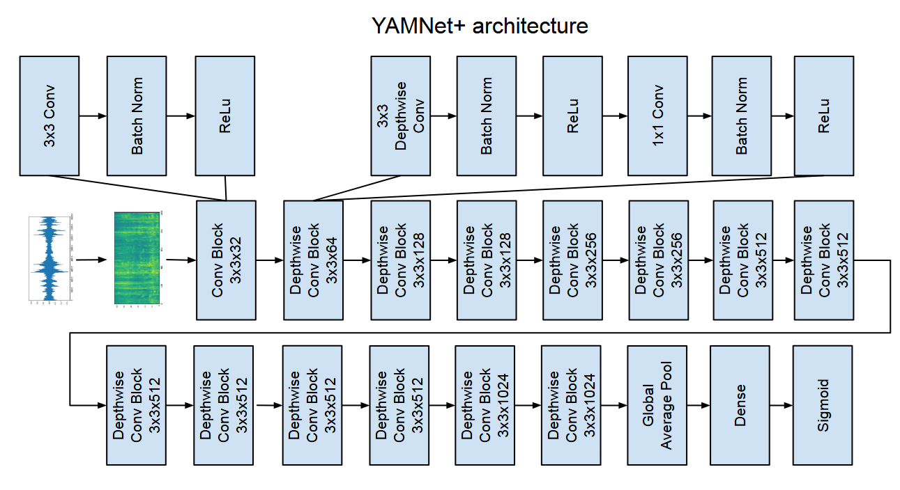

## Henry Zhong Research
If you would like to collaborate on research, contact me using: hhcz728 (at) gmail (dot) com .

Research Interests:

* Ubiquitous Computing
* Computer Vision
* Machine Hearing

## Publications
Google Scholar [Link](https://scholar.google.com/citations?user=GSA0YwsAAAAJ&hl=en)

Research Gate [Link](https://www.researchgate.net/profile/Henry_Zhong)

* Zhong, Henry, et al. "A dataset and model for auditory scene recognition for hearing devices: AHEAD-DS and OpenYAMNet." arXiv preprint arXiv:2508.10360 (2025). [Link](https://arxiv.org/abs/2508.10360)

## Project/Code/Data Samples

### AHEAD-DS and OpenYAMNet/YAMNet+


[Paper](https://arxiv.org/abs/2508.10360)  
[Code](https://github.com/Australian-Future-Hearing-Initiative/prism-ml)  
[Dataset Mixed](https://huggingface.co/datasets/hzhongresearch/ahead_ds)  
[Dataset Unmixed](https://huggingface.co/datasets/hzhongresearch/ahead_ds_unmixed)  
[Model](https://huggingface.co/hzhongresearch/yamnetp_ahead_ds)  
[Project Website](https://github.com/Australian-Future-Hearing-Initiative)

Another HEaring AiD scenes Data Set (AHEAD-DS) is a publicly available audio dataset of audiologically relevant environments for hearing aids. OpenYAMNet/YAMNet+ is a lightweight audio recognition model for deployment on resource constrained edge devices, it is a fully open source re-implementation of YAMNet.

The goal of this project was to design a workflow and toolchain to deploy audio recognition models to smartphones connected to wireless earphones. This project offers a baseline audio recognition model and a standardised dataset for comparing audio recognition models. This is a first step to creating AI enhanced hearing aids.

If you use this work please cite our paper.

```
@misc{zhong2026datasetmodelauditoryscene,
      title={A dataset and model for auditory scene recognition for hearing devices: AHEAD-DS and OpenYAMNet}, 
      author={Henry Zhong and Jörg M. Buchholz and Julian Maclaren and Simon Carlile and Richard Lyon},
      year={2026},
      eprint={2508.10360},
      archivePrefix={arXiv},
      primaryClass={cs.SD},
      url={https://arxiv.org/abs/2508.10360}, 
}
```

### VeinDeep


[Paper](https://www.researchgate.net/publication/316733062_VeinDeep_Smartphone_unlock_using_vein_patterns)  
[Code](https://github.com/hzhongresearch/veindeep_program)  
[Data](https://huggingface.co/datasets/hzhongresearch/veindeep_data)

VeinDeep is a system which uses an infrared (IR) depth sensor to extract vein patterns from a person's hand. The idea is in the future smartphones will be equipped with Kinect V2 like IR depth sensors. Such sensors can be used to identify the smartphone owner using vein patterns and provide a way to unlock the phone. This project was created during my PhD. The associated research paper was presented at PerCom 2017.

If you use this work please cite our paper.

```
@inproceedings{zhong2017veindeep,
	title={VeinDeep: Smartphone unlock using vein patterns},
	author={Zhong, Henry and Kanhere, Salil S and Chou, Chun Tung},
	booktitle={Pervasive Computing and Communications (PerCom), 2017 IEEE International Conference on},
	pages={2--10},
	year={2017},
	organization={IEEE}
}
```

### QuickFind


[Paper](https://www.researchgate.net/publication/301583832_QuickFind_Fast_and_contact-free_object_detection_using_a_depth_sensor)  
[Code](https://github.com/hzhongresearch/quickfind_program)  
[Data](https://huggingface.co/datasets/hzhongresearch/quickfind_mask_data)

QuickFind is a fast segmentation and object detection algorithm using only depth maps. Depth maps are images captured from depth sensors like Kinect. The idea is in the future depth sensors will be common so such an algorithm will be useful. This project was created during my PhD. The associated research paper was presented at PerCom Workshops 2016.

The data contains amended ground truth of the RGB-D Scenes dataset used in the QuickFind paper. The ground truth in the original RGB-D scenes dataset had many errors so I manually traced out the location of each object. Credit for RGB-D Scenes goes to Lai et al. Please visit their [site](https://rgbd-dataset.cs.washington.edu/dataset.html) and credit them if you use my amended data in conjunction with their RGB-D Scenes dataset.

If you use this work please cite our paper.

```
@inproceedings{zhong2016quickfind,
	title={Quickfind: Fast and contact-free object detection using a depth sensor},
	author={Zhong, Henry and Kanhere, Salil S and Chou, Chun Tung},
	booktitle={Pervasive Computing and Communication Workshops (PerCom Workshops), 2016 IEEE International Conference on},
	pages={1--6},
	year={2016},
	organization={IEEE}
}
```

## CV

### Education

| Degrees                                                         | Schools     | Dates       |
|:----------------------------------------------------------------|:------------|:------------|
| Doctor of Philosophy in Computer Science                        | UNSW Sydney | 2011 - 2017 |
| Ubiquitous Computing, Computer Vision                           |             |             |
| Bachelor of Engineering and Commerce                            | UNSW Sydney | 2005 - 2010 |
| 1st Class Honours - Software Engineering and Actuarial Studies. |             |             |

### Experience

| Organisations            | Roles                    | Dates       |
|:-------------------------|:-------------------------|:------------|
| Macquarie University     | Postdoc                  | 2024 - 2026 |
| Spiral Blue              | Co-founder, Head of AI   | 2018 - 2024 |
| Vardogyir                | Research and Development | 2018 - 2020 |
| UNSW Sydney              | Research Assistant       | 2015 - 2017 |
| NEC/UNSW Sydney          | Research Collaborator    | 2011 - 2014 |
| NICTA (now CSIRO/Data61) | Intern Developer         | 2009 - 2011 |
| Macquarie Group          | Intern Developer         | 2007 - 2008 |

### Skills

Tech - C#, C++, Keras, OpenCV, Pandas, Python, Pytorch, Tensorflow.


